<!--<h2 align="center"> Hi👋, I'm Haobo, welcome to my github page! </h2>-->
### Hi👋, I'm Haobo, welcome to my github page!
-------

 

-------

#### 📊 **Weekly development breakdown**
<!--START_SECTION:waka-->

```txt
From: 03 February 2026 - To: 10 February 2026

Rust         21 hrs 16 mins  ███████████████▒░░░░░░░░░   61.26 %
Python       5 hrs 36 mins   ████░░░░░░░░░░░░░░░░░░░░░   16.17 %
Markdown     2 hrs 23 mins   █▓░░░░░░░░░░░░░░░░░░░░░░░   06.88 %
Other        59 mins         ▓░░░░░░░░░░░░░░░░░░░░░░░░   02.87 %
```

<!--END_SECTION:waka-->
<!--
backup url: https://github-readme-status-dusky-ten.vercel.app/api?username=HaoboGu&count_private=true&show_icons=true&theme=transparent&border_color=2f80ed
-->
<!--
**HaoboGu/HaoboGu** is a ✨ _special_ ✨ repository because its `README.md` (this file) appears on your GitHub profile.

Here are some ideas to get you started:

- 🔭 I’m currently working on AI-assisted programming tools
- 🌱 I’m currently learning ...
- 👯 I’m looking to collaborate on ...
- 🤔 I’m looking for help with ...
- 💬 Ask me about ...
- 📫 How to reach me: ...
- 😄 Pronouns: ...
- ⚡ Fun fact: ...
-->
