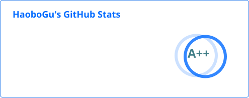

<!--<h2 align="center"> Hi👋, I'm Haobo, welcome to my github page! </h2>-->
### Hi👋, I'm Haobo, welcome to my github page!
-------

 

-------

#### 📊 **Weekly development breakdown**
<!--START_SECTION:waka-->

```txt
From: 25 August 2026 - To: 01 September 2026

Rust         9 hrs 6 mins          ████████▓░░░░░░░░░░░░░░░░   34.81 %
TOML         5 hrs 16 mins         █████░░░░░░░░░░░░░░░░░░░░   20.15 %
Markdown     4 hrs 16 mins         ████░░░░░░░░░░░░░░░░░░░░░   16.35 %
Bash         2 hrs 31 mins         ██▒░░░░░░░░░░░░░░░░░░░░░░   09.67 %
Other        1 hr 58 mins          ██░░░░░░░░░░░░░░░░░░░░░░░   07.54 %
```

<!--END_SECTION:waka-->
<!--
backup url: https://github-readme-status-dusky-ten.vercel.app/api?username=HaoboGu&count_private=true&show_icons=true&theme=transparent&border_color=2f80ed
-->
<!--
**HaoboGu/HaoboGu** is a ✨ _special_ ✨ repository because its `README.md` (this file) appears on your GitHub profile.

Here are some ideas to get you started:

- 🔭 I’m currently working on AI-assisted programming tools
- 🌱 I’m currently learning ...
- 👯 I’m looking to collaborate on ...
- 🤔 I’m looking for help with ...
- 💬 Ask me about ...
- 📫 How to reach me: ...
- 😄 Pronouns: ...
- ⚡ Fun fact: ...
-->
